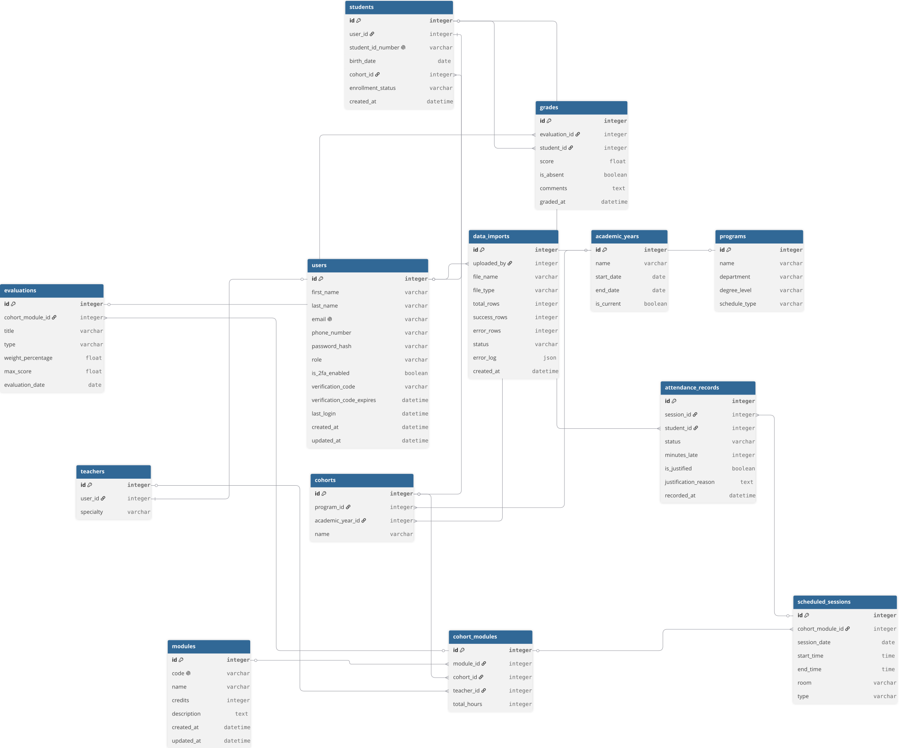

# Data Engineering & Database Architecture

This document details the data lifecycle of the EduTrack Analytics platform, covering the generation of synthetic correlated data, the relational database schema, and the advanced ETL (Extract, Transform, Load) pipeline used for data ingestion.

---

## 1. Data Generation Strategy

To train effective Machine Learning models (for risk prediction and clustering), the platform required a high-volume, realistic dataset.

### First Attempt: Mockaroo Limitations

Initially, I used Mockaroo to generate CSV files. However, the free tier limits generation to 1,000 rows per file. Because a single student generates multiple grades and attendance records, 1,000 rows were vastly insufficient to train an accurate predictive model.

### Second Attempt: Custom Python Data Engineering

To bypass these limits, I developed a custom Python script (`generate_data.py`) using `pandas` and `faker`. This approach allowed me to generate an infinite amount of data while injecting **mathematical correlations** to simulate real-world behavior:

- **Aptitude & Truancy Metrics:** Every synthetic student was assigned a hidden "aptitude" score and "truancy" (absence) probability.
- **Correlated Grades:** If a student's truancy rate triggered an absence, their score for that evaluation was automatically set to 0. Otherwise, their grade was calculated using their aptitude plus a random variance.

### Solving macOS Environment Constraints

While executing the script, I encountered strict macOS environment protections (`externally-managed-environment` and `ModuleNotFoundError`). To solve this, I isolated the project using a **Python Virtual Environment (`venv`)**, allowing `pip` to safely install dependencies without interfering with the global Apple OS configurations.

**Final Result:** Over 10,000 rows of highly realistic, correlated data were successfully exported into 10 CSV files.

---

## 2. Database Schema & Tables

The database is built on PostgreSQL using a strict relational model. Below is a brief explanation of the core tables:

### Identity & Access

- **`users`**: The central authentication table. Stores `first_name`, `last_name`, `email`, hashed passwords, and RBAC roles (Student, Teacher, Admin).
- **`data_imports`**: Tracks the history, success rate, and error logs of all CSV files uploaded via the ETL pipeline.

### Users Profiles

- **`students`**: Linked to `users`. Stores the student ID (matricule), birth date, and their assigned `cohort_id`.
- **`teachers`**: Linked to `users`. Stores the teacher's pedagogical specialty.

### Academic Structure

- **`academic_years`**: Defines the temporal scope (e.g., "2025-2026") and active status.
- **`programs`**: The overarching degrees (e.g., "B3 Data & IA", "M1 Tech & Business").
- **`cohorts`**: The specific class groups linking students to a Program and Academic Year.

### Pedagogy & Scheduling

- **`modules`**: The subjects taught, identified by a unique code (e.g., "DATA-301") and ECTS credits.
- **`cohort_modules`**: The junction table assigning a specific `module` to a `cohort`, taught by a specific `teacher`.

### Performance & Tracking

- **`evaluations`**: The exams or projects assigned to a specific `cohort_module`, including their maximum score and weight percentage.
- **`grades`**: The core metrics table storing the `score` achieved by a `student` in an `evaluation`. Includes an `is_absent` boolean.
- **`attendance_records`**: Tracks student presence per session (Present, Absent, Late).

---

## 3. Advanced ETL Pipeline (Extract, Transform, Load)

To handle user-uploaded data safely, I implemented a robust, class-based ETL pipeline (`cleaner.py` and `pipeline.py`) that acts as the ultimate authority on Data Governance.

### 1. Extract & Route

The frontend parses the CSV and sends it to the FastAPI backend. The `process_import_payload` function acts as a smart router, reading the `target_table` parameter and dynamically matching it to the correct validation schema.

### 2. Transform: Data Governance (`cleaner.py`)

Before any data touches the database, the `ETLDataCleaner` class enforces strict business rules:

- **Text Standardization:** Automatically converts emails to lowercase, first names to Title Case, and last names to UPPERCASE to prevent duplicates and maintain UI consistency.
- **Mathematical Grade Clamping:** Safely coerces scores to floats. Grades are mathematically clamped between `0.0` and `20.0`. If the `is_absent` flag is True, the score is forcefully overridden to `0.0`.
- **Enum Coercion:** Standardizes string variations of booleans (e.g., "yes", "1", "vrai") into actual boolean values, and maps random attendance strings strictly to recognized Enums (Present, Absent, Late).

### 3. Load: Safe Upsert (`pipeline.py`)

To prevent fatal `UniqueViolation` database crashes, the loading layer utilizes a safe **Upsert** logic:

- **Sequence Synchronization:** Before insertion, PostgreSQL ID sequences (`setval`) are explicitly synchronized to ensure manual seeds do not conflict with auto-incrementing primary keys.
- **Update or Insert:** The pipeline queries the database using unique constraints (like `email` or `student_id`). If the record exists, it updates the existing row. If it doesn't, it inserts a new one.
