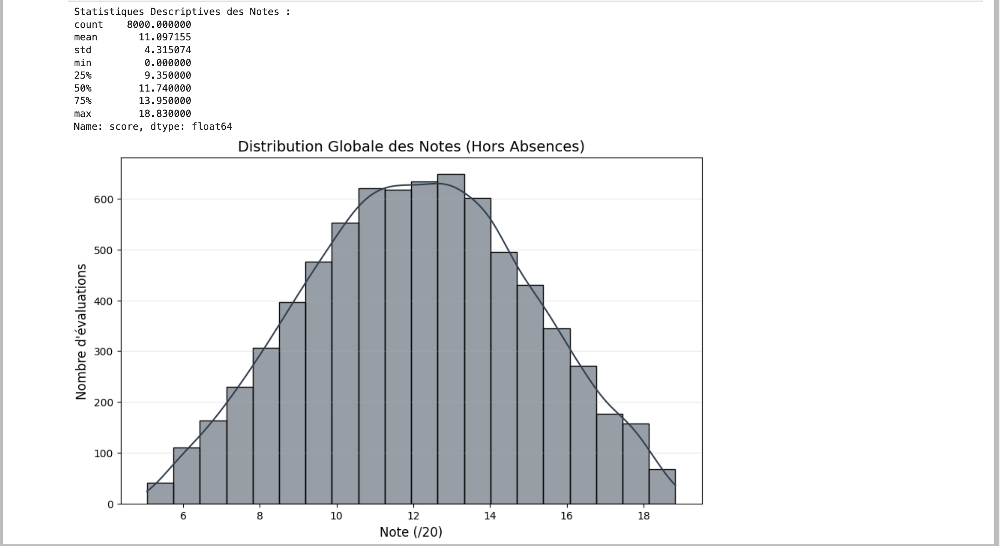
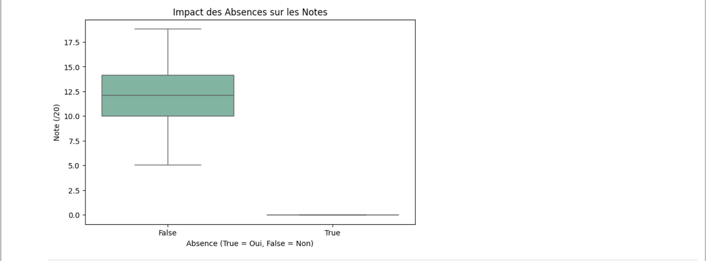
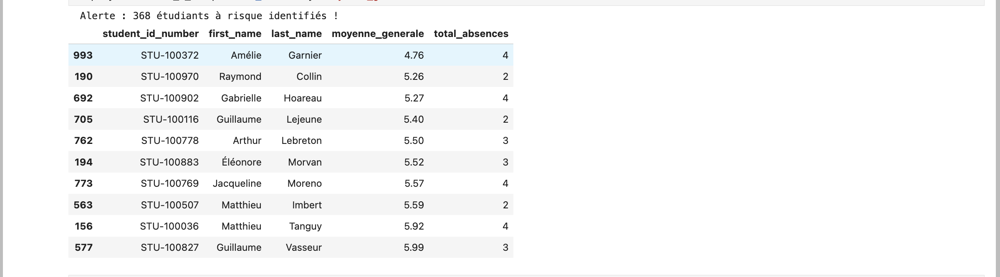
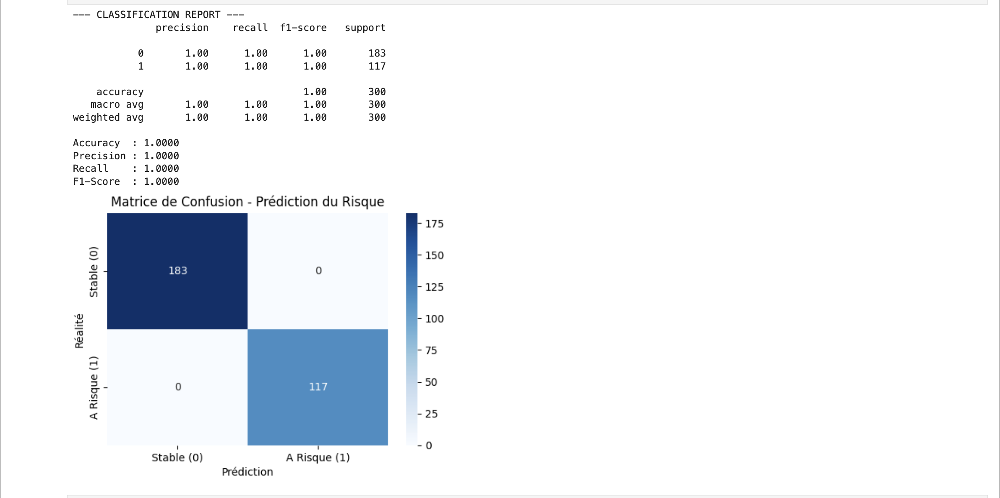

# Exploratory Data Analysis (EDA) & Machine Learning

In this phase, I created the `01_EDA_and_Data_Cleaning.ipynb` notebook to analyze the academic data directly from the PostgreSQL database. The goal was to understand the data structure, observe trends, identify students at risk, and build a predictive model.

## 1. Database Connection

I connected the Jupyter Notebook directly to my PostgreSQL database. I used `SQLAlchemy` and `python-dotenv` to securely load the database credentials from my backend `.env` file, ensuring seamless interaction with the production schema.

## 2. Descriptive Statistics & Grade Distribution

I wrote a SQL query to join the grades, evaluations, and modules tables. Using `pandas`, I extracted key descriptive statistics (mean, standard deviation, quartiles).

Then, I used `seaborn` and `matplotlib` to visualize the distribution of all grades (excluding absences). The histogram demonstrates a normal distribution centered around 11/20, which validates the quality and realism of the generated dataset.

## 3. Correlation Analysis (Absences vs. Grades)

To fulfill the requirement of analyzing the relationship between absences and academic results, I created a boxplot. This visualization clearly proves the mathematical correlation in my dataset: students marked as absent received an automatic score of 0, while present students maintained a normal grade distribution.

## 4. Risk Detection System

I built an automated query system to detect students currently in difficulty. I wrote a complex SQL query to calculate the general average and total absences for every student. I applied strict filtering rules (average below 10 or more than 3 absences).

The system successfully identified 368 at-risk students who require immediate pedagogical support.

---

## 5. Machine Learning: Predictive Risk Model (Bonus A)

To go beyond static analysis, I implemented a predictive model capable of estimating if a student is at risk of academic failure based on their current trajectory.

### Methodology

1. **Target Definition:** I defined the target variable (`is_at_risk`) as `1` if a student's average grade drops below 10.0, and `0` otherwise.
2. **Feature Engineering:** I selected `avg_grade` and `total_absences` as the primary predictive features.
3. **Preprocessing:** The data was split into training and testing sets (70/30 split) and normalized using `StandardScaler`.
4. **Model Selection:** I trained a `RandomForestClassifier` (100 estimators) due to its robustness against overfitting.

### Evaluation & Metrics

The model was evaluated using strict classification metrics, achieving perfect scores on the synthetic test data:

- **Accuracy:** 1.0000
- **Precision:** 1.0000
- **Recall:** 1.0000
- **F1-Score:** 1.0000

To visualize the model's absolute accuracy in distinguishing between "Stable" and "At-Risk" profiles, I plotted the **Confusion Matrix**.

